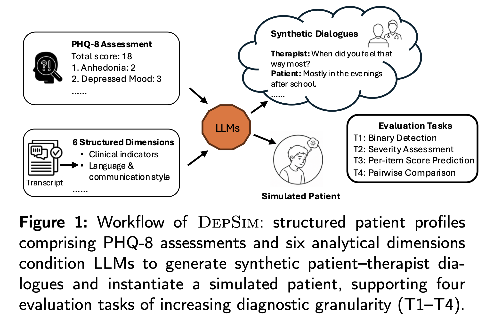
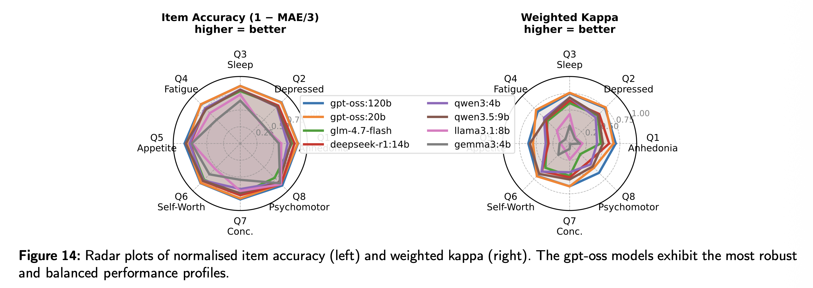

# DepSim: Real-Patient-Grounded Synthetic Dialogue Generation and Depression Screening Benchmark

[](LICENSE)

> **DepSim** is a pipeline that extracts six-dimensional structured profiles from 275 real E-DAIC participants and generates PHQ-8-consistent synthetic patient–therapist dialogues. It also introduces a four-task benchmark for evaluating LLMs on conversation-based depression screening.

## Overview

Automated depression screening via conversational AI could help bridge the mental health treatment gap, but progress is held back by the scarcity of clinically annotated dialogue data and the absence of standardized evaluation benchmarks. **DepSim** addresses both gaps:

1. **A profile extraction pipeline** that converts real clinical interview transcripts (E-DAIC) into six-dimensional structured patient profiles.
2. **A multi-LLM dialogue generation engine** that produces PHQ-8-grounded synthetic conversations.
3. **A four-task benchmark** for evaluating LLMs on binary detection, severity regression, per-item symptom prediction, and pairwise severity ranking.

**Result:** 11,000 synthetic conversations across 275 participants, spanning the full PHQ-8 severity spectrum (none/minimal to severe).

## The Six-Dimensional Patient Profile

Each patient is represented by a structured profile with six dimensions:

| Dimension | Description |
|-----------|-------------|
| **PHQ-8 Assessment** | Item-level scores (0–3 per item), total score (0–24), binary depression label |
| **Clinical Indicators** | Symptom manifestations, anhedonia, energy, psychomotor patterns |
| **Memory & Reflection** | Biographical context, life history, social environment, salient experiences |
| **Language & Communication Style** | Utterance length, hedging, tense distribution, affective tone |
| **Behavioral Constraints** | Avoidance behaviors, resistance to probing, emotional disclosure thresholds |
| **Response Goals** | Self-presentation strategy (appear stable, seek empathy, project competence) |
| **Environment & Context** | Socioeconomic background, life circumstances, adaptation to virtual interview |

## Pipeline Architecture

The generation pipeline operates in three successive LLM stages:

```
┌─────────────────────────────────────────────────────────────┐
│                     Participant Profile                      │
│  (6 dimensions + PHQ-8 item-level scores)                   │
└──────────┬──────────────────────────────────────────────────┘
           │
           ▼
┌─────────────────────────────────────────────────────────────┐
│  Stage 1: Conversation Generation (LLM-1)                   │
│  ─ Acts as experienced psychotherapist                      │
│  ─ Generates 5 dialogues × ~10 turns each per participant   │
│  ─ Clinical symptoms expressed implicitly, not labeled      │
│  ─ Diverse topics across dialogues (work, relationships…)   │
└──────────┬──────────────────────────────────────────────────┘
           │
           ▼
┌─────────────────────────────────────────────────────────────┐
│  Stage 2: Automated Evaluation (LLM-2)                      │
│  ─ Acts as licensed clinical psychologist                   │
│  ─ Predicts PHQ-8 total score from 5 dialogues              │
│  ─ Validation: |predicted − target| < 3                     │
└──────────┬──────────────────────────────────────────────────┘
           │
      ┌────┴────┐
      ▼         ▼
   Pass?      Fail?
      │         │
      │         ▼
      │    ┌─────────────────────────────────────────┐
      │    │ Stage 3: Feedback & Regeneration         │
      │    │ ─ Structured feedback (scores + profile  │
      │    │   + LLM-2 evaluation) appended to prompt │
      │    │ ─ LLM-1 revises all 5 dialogues          │
      │    │ ─ Iterates up to 50× per participant     │
      │    └─────────────────────────────────────────┘
      │
      ▼
┌─────────────────────────────────────────────────────────────┐
│  Post-Processing (LLM-3)                                    │
│  ─ Standardizes format                                     │
│  ─ Saves profile + conversation set as patient simulator    │
└─────────────────────────────────────────────────────────────┘
```

<!--  -->

<p align="center">
  
</p>

**Key design choice:** The same LLM plays all three roles (LLM-1, LLM-2, LLM-3) within a single pipeline run, ensuring internal consistency.

## Dataset Statistics

| Severity | PHQ-8 Range | Participants | Conversations | % of Total |
|----------|-------------|-------------|---------------|------------|
| None / Minimal | 0–4 | 122 | 4,880 | 44.4% |
| Mild | 5–9 | 67 | 2,680 | 24.4% |
| Moderate | 10–14 | 43 | 1,720 | 15.6% |
| Moderately Severe | 15–19 | 33 | 1,320 | 12.0% |
| Severe | 20–24 | 10 | 400 | 3.6% |
| **Total** | **0–24** | **275** | **11,000** | **100%** |

The distribution mirrors real-world epidemiological patterns, with higher-severity depression substantially less prevalent.

## Evaluated Models

| Model | Parameters | Active Params | Architecture |
|-------|-----------|---------------|--------------|
| **gpt-oss:120b** | ~117B | 5.1B | Sparse MoE |
| **gpt-oss:20b** | ~21B | 3.6B | Sparse MoE |
| **glm-4.7-flash** | ~31B | 3B | Sparse MoE (bilingual) |
| **deepseek-r1:14b** | 14B | 14B | Dense, Chain-of-Thought |
| **qwen3:4b** | 4B | 4B | Dense |
| **qwen3.5:9b** | 9B | 9B | Dense |
| **llama-3.1:8b** | 8B | 8B | Dense |
| **gemma3:4b** | 4B | 4B | Dense |

## Benchmark Tasks

### Task 1: Binary Depression Assessment
Given synthetic dialogues, predict *depressed* vs. *not depressed*.

| Model | Acc | F1_M | F1_W | AUC-ROC | Pre_1 | Recall_1 | F1_1 |
|-------|-----|------|------|---------|-------|----------|------|
| **gpt-oss:120b** | 0.8436 | 0.8112 | 0.8519 | 0.8608 | 0.6211 | 0.8939 | 0.7329 |
| **gpt-oss:20b** | 0.8436 | 0.8151 | 0.8529 | **0.8764** | 0.6139 | 0.9394 | 0.7425 |
| glm-4.7-flash | 0.7299 | 0.7087 | 0.7495 | 0.8066 | 0.4701 | 0.9545 | 0.6300 |
| deepseek-r1:14b | **0.7855** | **0.7584** | **0.8004** | 0.8381 | **0.5299** | 0.9394 | **0.6776** |
| qwen3:4b | 0.7055 | 0.6811 | 0.7269 | 0.7699 | 0.4436 | 0.8939 | 0.5930 |
| qwen3.5:9b | 0.7091 | 0.6895 | 0.7301 | 0.7931 | 0.4500 | 0.9545 | 0.6117 |
| llama3.1:8b | 0.3469 | 0.3338 | 0.2858 | 0.5683 | 0.2716 | 1.000 | 0.4272 |
| gemma3:4b | 0.4727 | 0.4725 | 0.4785 | 0.6324 | 0.3054 | 0.9394 | 0.4610 |

### Task 2: Holistic Severity Assessment
Predict the PHQ-8 total score (0–24) from five dialogues.

- **gpt-oss:20b** leads with lowest MAE and highest Pearson/Spearman correlations
- All models exhibit **positive mean bias** (overestimation), with gpt-oss variants most calibrated (±~0.3)
- **U-shaped performance**: highest accuracy at extremes (none/minimal & severe), lowest in the mild–moderate transition zone (5–14)

### Task 3: Per-Item PHQ-8 Score Prediction
Predict each of the 8 PHQ-8 item scores (0–3) independently.



- **Psychomotor (Q8)** is the easiest item (53–72% accuracy)
- **Fatigue (Q4)** and **Self-worth (Q6)** are the hardest
- gpt-oss models achieve 53–72% per-item accuracy; smaller models approach random on subjective dimensions
- **Appetite (Q5)** is systematically underestimated by all models — the only item with negative bias

### Task 4: Pairwise Severity Comparison
Given two patients' conversation sets, determine which is more depressed.

| Condition | Avg Accuracy | Best Model |
|-----------|-------------|------------|
| Cross-Severity (distinct bands) | 82.91% | qwen3.5:9b / qwen3:4b (88.00%) |
| Mixed (any pair) | 77.39% | gpt-oss:120b (82.02%) |

44.03% of errors involve participants from the **same severity band**, confirming adjacent-band discrimination as the hardest challenge.

## Key Findings

1. **Capability hierarchy:** gpt-oss > deepseek-r1:14b > mid-tier (glm, qwen) > small models (llama, gemma). Reasoning architecture matters more than parameter scale.
2. **Systematic overestimation:** All models over-predict severity (high recall, low precision). The sole exception is appetite (Q5), where underestimation dominates.
3. **Task difficulty scales with granularity:** Binary detection is feasible (AUC-ROC up to 0.876), but item-level scoring remains an open challenge (53–72% accuracy for top models).
4. **The mild–moderate boundary** is the hardest region across all tasks — the priority target for future improvement.

## Code Organization

```
depsim/
├── depsim/                        # Main Python package
│   ├── profile/                   # Six-dimensional profile extraction
│   │   ├── extractor.py           # Parse E-DAIC transcripts → structured profiles
│   │   ├── dimensions.py          # Dimension definitions and schemas
│   │   └── phq8.py                # PHQ-8 scoring utilities
│   │
│   ├── generation/                # LLM-1: Conversation generation
│   │   ├── pipeline.py            # Orchestrates 5-dialogue generation per participant
│   │   ├── prompts.py             # Therapist/patient system prompts
│   │   └── constraints.py         # Topic diversity and implicit symptom constraints
│   │
│   ├── evaluation/                # LLM-2: Automated clinical evaluation
│   │   ├── judge.py               # PHQ-8 prediction from dialogues
│   │   └── validation.py          # Score acceptance criterion (|Δ| < 3)
│   │
│   ├── feedback/                  # LLM-3: Feedback-driven regeneration loop
│   │   ├── loop.py                # Iterative refinement (up to 50 iterations)
│   │   └── feedback_prompt.py     # Structured feedback prompt construction
│   │
│   ├── postprocessing/            # Output standardization
│   │   └── standardize.py         # Format dialogues + profile as patient simulator
│   │
│   ├── benchmark/                 # Four-task evaluation suite
│   │   ├── task1_binary.py        # Binary depression classification
│   │   ├── task2_severity.py      # Holistic PHQ-8 severity regression
│   │   ├── task3_item.py          # Per-item score prediction
│   │   ├── task4_pairwise.py      # Pairwise severity comparison
│   │   └── metrics.py             # Shared evaluation metrics
│   │
│   ├── models/                    # LLM interface layer
│   │   ├── base.py                # Abstract LLM client
│   │   └── ollama_client.py       # Ollama-compatible OpenAI endpoint wrapper
│   │
│   └── utils/                     # Shared utilities
│       ├── io.py                  # JSON/data serialization
│       └── logging.py             # Experiment logging
│
├── config/                        # Configuration files
│   ├── models.yaml                # Model registry (endpoints, parameters)
│   └── pipeline.yaml              # Pipeline defaults (temperature, iterations, etc.)
│
├── data/                          # Data directory
│   ├── profiles/                  # Extracted participant profiles (JSON)
│   ├── dialogues/                 # Generated synthetic conversations (JSON)
│   └── edaic/                     # Original E-DAIC transcripts (not redistributed)
│
├── scripts/                       # Entry-point scripts
│   ├── run_pipeline.py            # Full generation pipeline entry point
│   └── run_benchmark.py           # Benchmark evaluation entry point
│
├── requirements.txt               # Python dependencies
└── README.md                      # This file
```

## Getting Started

```bash
# Clone the repository
git clone https://github.com/HumSCI2/DepSimBench.git
cd DepSimBench

# Install dependencies
pip install -r requirements.txt

# Run the generation pipeline
python scripts/run_pipeline.py --model gpt-oss:20b --participants all
```

### Requirements

- Python 3.10+
- Ollama-compatible OpenAI endpoint
- Access to E-DAIC dataset (for profile extraction; generated dialogues are synthetic)

### Reproducing Benchmark Results

```bash
# Evaluate all models on all four tasks
python scripts/run_benchmark.py --all-models --tasks 1 2 3 4
```

## Ethical Considerations

- All E-DAIC participant data was originally collected under informed consent and IRB approval
- We do not redistribute raw audio or video — only derived structured profiles and LLM-generated synthetic conversations
- The generated dialogues are entirely synthetic; no text is copied from original transcripts beyond short illustrative quotes used for profile construction
- **This resource is intended exclusively for research on screening methodology and is not a clinical diagnostic tool**
- False negatives may deprive at-risk individuals of support; false positives may cause unnecessary distress or stigma

## Citation

```
@article{depsim2025,
  title={DepSim: Real-Patient-Grounded Synthetic Dialogue Generation
         and Depression Screening Benchmark},
  author={...},
  journal={...},
  year={2025}
}
```

## License

MIT

## Acknowledgments

- [E-DAIC](https://dcapswoz.ict.usc.edu/) dataset from the USC Institute for Creative Technologies
- [Ollama](https://ollama.ai/) for model serving infrastructure
